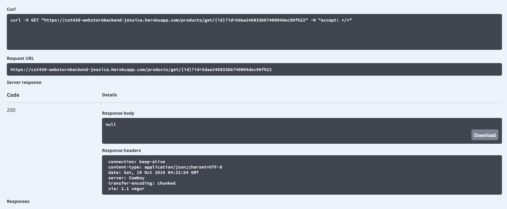
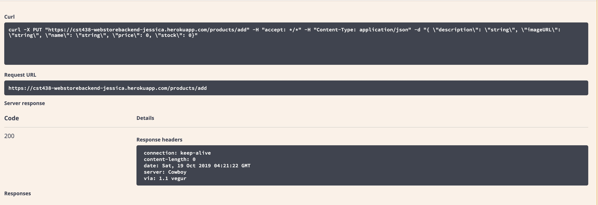
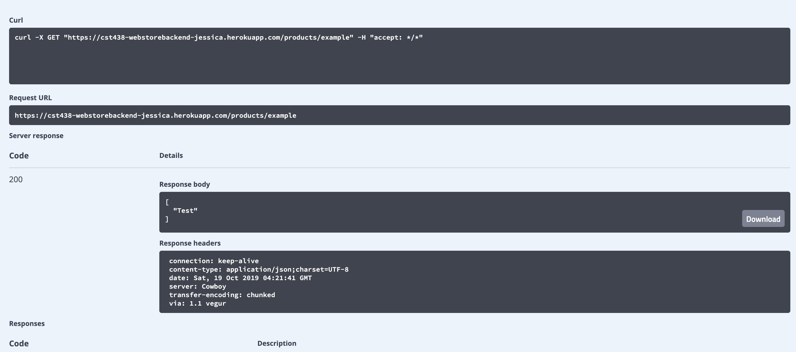

# Webstore

**WebStore* is a web application where the backend is implemented by using Spring boot.

Submitted by: **Jessica Rios**

## RESTful API
The following web application can use the following API:
**products/add**
Adds products by inserting the description, imageURL, name, price, and stock.
**products/example**
This is a testing RESTful API to see if the api call is function correct. If it is functioning correct, then Test should be displayed.
**products/getAll**
Returns all the products stored from the database.
**get/{id}?=_id_**
If _id_ is found, the _id_ after ?= needs to be replaced by the actual ID stored from the database.

## Image Examples

Here's are pictures of different ways to call the api:

## Notes
For Heroku Link:
<a href="https://cst438-webstorebackend-jessica.herokuapp.com/products/getAll">Heroku: Web Store</a>

## License

Copyright [2019] [Jessica Rios]

Licensed under the Apache License, Version 2.0 (the "License");
you may not use this file except in compliance with the License.
You may obtain a copy of the License at

http://www.apache.org/licenses/LICENSE-2.0

Unless required by applicable law or agreed to in writing, software
distributed under the License is distributed on an "AS IS" BASIS,
WITHOUT WARRANTIES OR CONDITIONS OF ANY KIND, either express or implied.
See the License for the specific language governing permissions and
limitations under the License.
